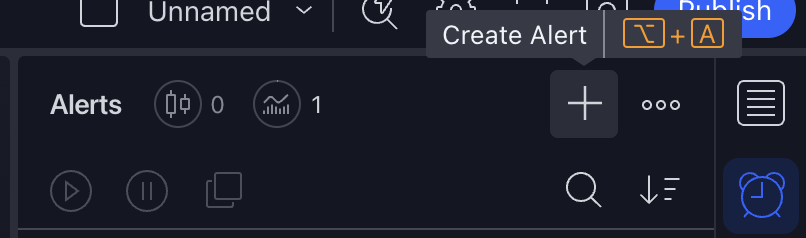
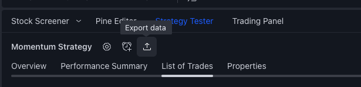

<h1>FinnizeClient</h1>

The FinnizeClient is an open-source library that assists investors in uploading their signals to the Finnize platform.

## Table of Contents

- [Table of Contents](#table-of-contents)
- [Installation](#installation)
- [Workflow](#workflow)
  - [Python](#python)
    - [Upload Daily Signal](#upload-daily-signal)
    - [Upload Backtest Signal](#upload-backtest-signal)
  - [TradingView](#tradingview)
    - [Upload Daily Signal](#upload-daily-signal-1)
    - [Upload Backtest Signal](#upload-backtest-signal-1)

## Installation

```bash
pip install git+https://github.com/finnize/finnizeclient
```

## Workflow

Before uploading any signals to the Finnize website, you need to know the `strategy_id`. This is important because if the strategy does not exist, the upload method will raise a 404 error indicating 'Strategy not found'.

### Python

coming soon..

#### Upload Daily Signal

coming soon..

#### Upload Backtest Signal

coming soon..

---

### TradingView

#### Upload Daily Signal

1. Open the TradingView application.
2. Click on **"Pine Editor"** and paste the following string template below.

   ```python
   # Put the numbers in place of 'strategy_number' and 'strategy_weight' in the example below.
   # long_template =  '{ "strategy_id": strategy_number, "signals": [{"signal_at": "{{timenow}}", "signal": {"S50": strategy_weight}}]}'

   long_template =  '{ "strategy_id": 3907697156338858, "signals": [{"signal_at": "{{timenow}}", "signal": {"S50": 1}}]}'
   short_template =  '{ "strategy_id": 3907697156338858, "signals": [{"signal_at": "{{timenow}}", "signal": {"S50": 0}}]}'
   exit_template =  '{ "strategy_id": 3907697156338858, "signals": [{"signal_at": "{{timenow}}", "signal": {"S50": -1}}]}'

   # Write 'enterLong,' 'exitLong,' 'enterShort,' and 'exitShort' based on your strategy's conditions..
   if (enterLong)
       strategy.entry("long", strategy.long, alert_message = long_template)
   if (exitLong)
       strategy.close("long", alert_message = exit_template)
   if (enterShort)
       strategy.entry("short", strategy.short, alert_message = short_template)
   if (exitShort)
       strategy.close("short", alert_message = exit_template)

   ```

3. Create a Alert
<div align="center">
    
</div>

4. Choose the **Settings** menu and click on **Condition**. Select a name that matches your strategy name, and enter the following information in the **Message** field: `{{strategy.order.alert_message}}`. This means that the alert template will be sent via the alert message.

   ```python
   # @version=5
   strategy("Finnize Example", overlay=true)
   ```

<div align="center">
    
</div>

5. Choose the **Notification** menu. and click on **"Enable Webhook URL"**, then enter the correct webhook URL to send signals to the Finnize website.
<div align="center">
    
</div>

#### Upload Backtest Signal

1. Open the TradingView application.
2. Recommended set up the timezone TradingView as **(UTC+7) Bangkok**.
    - If users haven't exported data in UTC+7, they can address this by adjusting the utc parameter within the function's `upload_tradingview_signal()`.
3. Select the strategy that you want to upload, and click **List of Trades**, and then export the `CSV` files.

<div align="center">
    
</div>

4. Open the Visual Code Studio application.
5. Follow the steps outlined in the sample code within the `/example` folder, specifically in the file named `upload_signal_example.py`.
